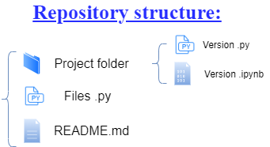

# Machine Learning and Deep Learning RGB-D project
Repository of the project for the Machine Learning and Deep Learning course on RGB-D Domain Adaptation with Cross-Modality Self-Supervision.

Team members:
*   Akafak Sokeng Jordan Derlich
*   Calvi Edoardo
*   Garbarino Matteo

